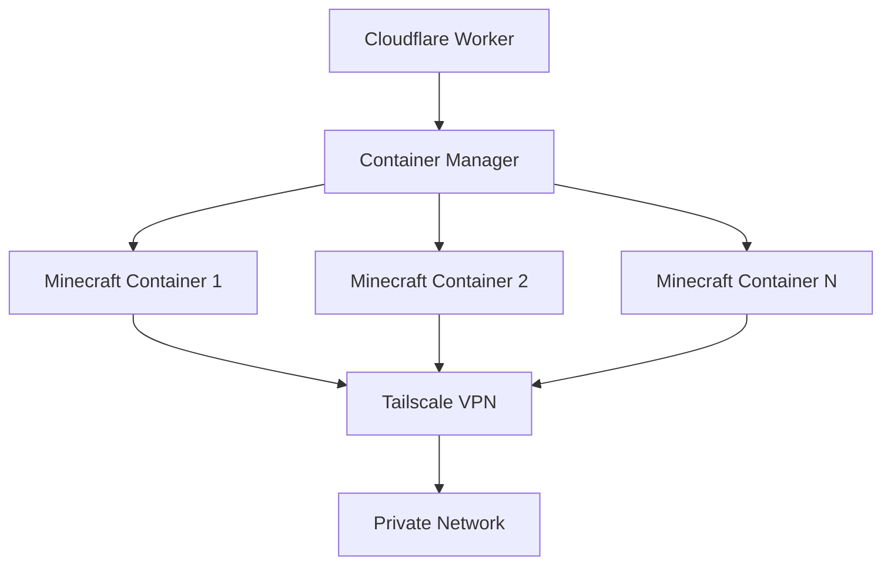

# AGENTS.md
This file provides guidance to Verdent when working with code in this repository.

## Table of Contents
1. Commonly Used Commands
2. High-Level Architecture & Structure
3. Key Rules & Constraints
4. Development Hints

## Commands
- `bun run build` - Compile TypeScript
- `bun run dev` - Start development environment with Alchemy
- `bun run deploy` - Deploy to Cloudflare (requires .env file)
- `bun run destroy` - Destroy deployed resources
- `bun run configure` - Configure Alchemy settings
- `bun run login` - Login to Alchemy

## Architecture
- **Cloudflare Workers + Containers**: Uses Alchemy to deploy a Hono-based worker that manages Minecraft server containers
- **Container Management**: MinecraftContainer class extends @cloudflare/containers Container, runs Minecraft server with Tailscale VPN
- **Request Routing**: Hono app routes requests to specific containers by ID, supports load balancing and singleton patterns
- **External Dependencies**: Tailscale for private networking, Minecraft server (itzg/minecraft-server Docker image)
- **Development Entry Points**: `src/worker.ts` (main worker), `alchemy.run.ts` (infrastructure config)

## Key Rules & Constraints
- Container sleeps after 20 minutes of inactivity (configurable in MinecraftContainer)
- RCON password is hardcoded as "minecraft" (safe on private tailnet)
- Containers expose ports: 8080 (health checks), 8081 (Minecraft game traffic), 25575 (RCON console)
- Requires TS_AUTHKEY environment variable for Tailscale authentication
- Uses userspace networking mode for container compatibility
- EULA automatically accepted for Minecraft server

## Development Hints
- **Adding new container endpoints**: Extend routes in src/worker.ts Hono app, follow existing patterns for container ID routing
- **Modifying container configuration**: Update MinecraftContainer class envVars, sleepAfter, or lifecycle hooks
- **Container debugging**: Use `/error` endpoint to test error handling, check container logs via Alchemy dashboard
- **Environment variables**: Add to MinecraftContainer.envVars for container-level config, or worker bindings in alchemy.run.ts for worker-level config
- **Tailscale configuration**: Modify TS_* environment variables in MinecraftContainer.envVars or update start-with-services.sh script